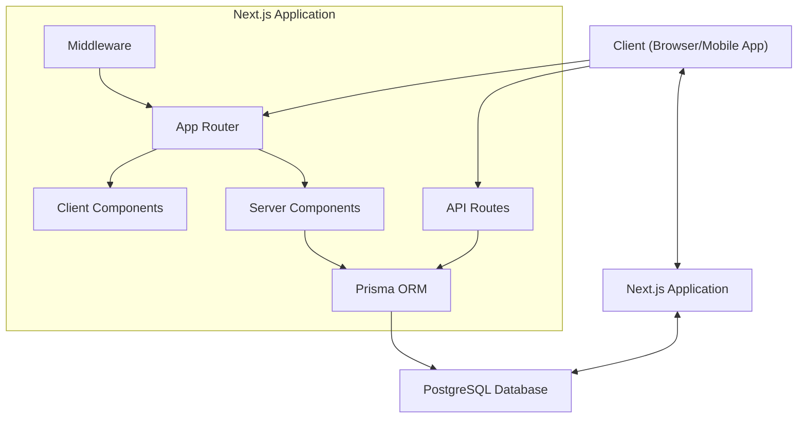
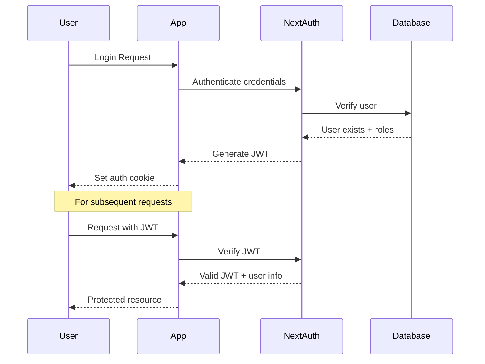

# 1nga Architecture Overview

This document provides a comprehensive overview of the 1nga e-commerce platform architecture, designed specifically for the Malawian market.

## Architectural Principles

The 1nga platform is built on the following key architectural principles:

- **Server Components First**: Leveraging React Server Components for improved performance and SEO
- **Feature-Based Structure**: Organizing code by business domain rather than technical layers
- **Layered Design**: Separating concerns with clear interfaces between layers
- **End-to-End Type Safety**: Using TypeScript throughout the stack
- **Progressive Enhancement**: Ensuring functionality with or without JavaScript
- **Optimistic Updates**: Providing instant feedback while operations complete in the background
- **Mobile-First**: Designing for mobile devices first, then enhancing for larger screens
- **API-Driven**: Building around well-defined API contracts

## High-Level Architecture



### Key Components

1. **Frontend Layer**
   - Next.js App Router architecture
   - React Server Components for SEO and performance
   - Client Components for interactive UI elements
   - TailwindCSS for styling
   - Framer Motion for animations

2. **API Layer**
   - RESTful API endpoints for CRUD operations
   - API Routes for backend processing
   - Input validation using Zod
   - Rate limiting and security middleware

3. **Business Logic Layer**
   - Service modules for domain-specific logic
   - Transaction management
   - Event handling
   - Validation and business rules

4. **Data Access Layer**
   - Prisma ORM for database operations
   - PostgreSQL for relational data storage
   - Redis for caching and session management
   - Connection pooling for scalability

5. **Infrastructure Layer**
   - Vercel deployment platform
   - AWS for additional services
   - Monitoring and logging
   - Backup and recovery systems

## Code Organization

The 1nga codebase follows a feature-based structure within a Next.js application:

```
src/
├── app/                    # Next.js App Router
│   ├── api/                # API routes
│   ├── (shop)/             # Customer-facing routes
│   ├── seller/             # Seller dashboard routes
│   └── admin/              # Admin dashboard routes
├── components/             # Shared UI components
│   ├── ui/                 # Basic UI elements
│   ├── shared/             # Shared complex components
│   └── [feature]/          # Feature-specific components
├── lib/                    # Shared utilities and functions
├── hooks/                  # React hooks
├── features/               # Feature-specific code
│   ├── products/           # Product-related code
│   ├── checkout/           # Checkout-related code
│   └── ...                 # Other features
├── services/               # External service integrations
├── styles/                 # Global styles and Tailwind config
└── types/                  # TypeScript types and interfaces
```

### Route Structure

The application uses Next.js App Router with route groups:

- `/(shop)/`: Customer-facing storefront
- `/seller/`: Seller dashboard and management
- `/admin/`: Administrative dashboard
- `/api/`: API endpoints for data operations

## Authentication Flow

The authentication system is built on NextAuth.js with JWT tokens:



### Authentication Features

- Email/password authentication
- SMS verification for Malawian users
- Role-based access control
- JWT with short expiry and refresh tokens
- Secure password hashing with bcrypt
- Account recovery workflows
- 2FA for admin and seller accounts

## Database Design

The database uses PostgreSQL with the following high-level schema:

- **Users**: Customer, seller, and admin accounts
- **Products**: Product listings with variants
- **Categories**: Product categorization
- **Inventory**: Stock management
- **Orders**: Order processing and history
- **Payments**: Payment processing and history
- **Reviews**: Product and seller reviews
- **Promotions**: Discounts and special offers

## API Structure

APIs follow RESTful conventions with versioned endpoints:

- `GET /api/v1/products`: List products with filtering
- `GET /api/v1/products/:id`: Get product details
- `POST /api/v1/orders`: Create a new order
- `GET /api/v1/users/me`: Get current user information

## Performance Optimization

The platform implements several performance strategies:

- Server Component rendering for reduced JavaScript
- Image optimization with Next.js Image component
- Incremental Static Regeneration for dynamic pages
- Edge caching for static assets
- Database query optimization with indexes
- Connection pooling for database efficiency
- Code splitting for reduced bundle sizes

## Security Measures

Security is implemented at multiple levels:

- Input validation on all user inputs
- CSRF protection
- SQL injection prevention with Prisma
- XSS protection
- Rate limiting for API endpoints
- Content Security Policy headers
- Regular security audits and penetration testing

## Mobile Considerations

The platform is designed mobile-first with:

- Responsive design using Tailwind CSS
- Progressive Web App capabilities
- Touch-optimized interfaces
- Reduced data usage options for Malawian mobile networks
- Offline support for key functionality

## Technology Stack Decisions

| Technology | Purpose | Rationale |
|------------|---------|-----------|
| Next.js | Full-stack framework | Server components, built-in API routes, efficient rendering |
| React | UI library | Component-based UI, large ecosystem, server components |
| TypeScript | Type safety | Catch errors early, improved developer experience |
| PostgreSQL | Database | Relational model fits e-commerce, ACID compliance |
| Prisma | ORM | Type-safe database queries, migrations, schema management |
| TailwindCSS | Styling | Utility-first approach, consistent design system |
| NextAuth.js | Authentication | Flexible auth patterns, works well with Next.js |
| Vercel | Hosting | Zero config deployments, edge functions, CDN |
| Framer Motion | Animations | Declarative animations, performance optimized |

## Further Reading

- [Database Schema](./database)
- [Authentication Flow](./auth)
- [API Documentation](/api/)
- [Development Guide](/development/setup)